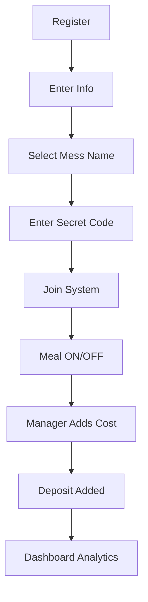

<div align="center">

  

# 🍽️ SmartMeal (MealBoard)

### *Modern Full-Stack Meal Management System*

**Next.js 16 • MongoDB • NextAuth • Tailwind CSS • DaisyUI**

<br/>

[](https://smart-meal-beta-nine.vercel.app/)

</div>

---

## 📸 Screenshots

<div align="center">

| 🔐 Register                                                                                        | 📊 Controller Dashboard                                                                            | 👨‍💻 Manager Dashboard                                                                            |
| -------------------------------------------------------------------------------------------------- | -------------------------------------------------------------------------------------------------- | -------------------------------------------------------------------------------------------------- |
|  |  |  |

| 💰 Cost                                                                                            | 💳 Meal ON/OFF                                                                                     | 🤖 AI                                    |
| -------------------------------------------------------------------------------------------------- | -------------------------------------------------------------------------------------------------- | ---------------------------------------- |
|  |  |  |

</div>

---

## ✨ Features

* 🔐 Authentication (NextAuth)
* 👥 Role-based system
* 📅 Meal tracking system
* 💰 Cost management
* 💳 Deposit system
* 📊 Smart dashboards
* 🧮 Meal calculator
* 🤖 Health AI chatbot

---

## 👨‍💼 Roles & Permissions

<div align="center">

### 🧑‍✈️ Controller (Admin)

| Feature              | Access               |
| -------------------- | -------------------- |
| 🔐 Secure Register   | Secret Code Required |
| 👨‍💻 Assign Manager | Yes                  |
| 👥 Manage Users      | Full Access          |
| 🍛 Meal Control      | ON/OFF Any User      |
| 📊 Full Analytics    | Yes                  |

---

### 🧑‍💻 Manager

| Feature            | Access |
| ------------------ | ------ |
| 💰 Add Cost        | Daily  |
| 📊 Cost History    | Yes    |
| 💳 Add Deposit     | Yes    |
| 📜 Deposit History | Yes    |
| 📈 Dashboard       | Full   |

---

### 🙋 Member

| Feature         | Access                 |
| --------------- | ---------------------- |
| 📝 Register     | Personal Info Required |
| 🏷️ Mess Select | Select Mess Name       |
| 🔐 Secret Code  | Required               |
| 🍽️ Meal Toggle | ON/OFF                 |
| 📊 Dashboard    | Personal               |

</div>

---

## 🔄 System Flow



---

## 📊 Dashboards

### 👤 Member

* Total Meals
* Total Cost
* Total Deposit

### 👨‍💻 Manager

* Today Meals
* Total Meals
* Total Cost
* Total Deposit
* Meal Rate

### 🧑‍✈️ Controller

* Total Users
* Total Meals
* Total Cost
* Total Deposit

---

## 🧮 Meal Calculator

* Auto Meal Count
* Meal Rate
* Individual Cost

---

## 🤖 Health AI

* Ask health questions
* Get instant answers

---

## 🛠️ Tech Stack

* ⚛️ Next.js 16
* ⚛️ React 19
* 🍃 MongoDB
* 🔐 NextAuth
* 🎨 Tailwind + DaisyUI
* 📊 Recharts

---

## ⚙️ Installation

```bash
git clone https://github.com/mehedi67719/smartmeal.git
cd smartmeal
npm install
npm run dev
```

---

## 🔐 Environment Variables

```env
MONGODB_URI=your_uri
NEXTAUTH_SECRET=your_secret
NEXTAUTH_URL=http://localhost:3000
```

---

## 🔑 Demo Login

| Role       | Email                                           | Password   |
| ---------- | ----------------------------------------------- | ---------- |
| Controller | [meh67719@gmail.com](mailto:meh67719@gmail.com) | mehedi123  |
| Manager    | [jubayer@gmail.com](mailto:jubayer@gmail.com)   | jubayer123 |
| Member     | [tawhid@gmail.com](mailto:tawhid@gmail.com)     | tawhid123  |

---

## 🚀 Future Plan


* 🔔 Notification System
* 📈 Advanced Analytics
* 🌍 Multi Language

---

## 👨‍💻 Author

**Mehedi Hassan**

* 🌐 Portfolio: https://mehedihassanjashore.netlify.app
* 💻 GitHub: https://github.com/mehedi67719
* 🔗 LinkedIn: https://linkedin.com

---

## ⭐ Support

Give a ⭐ if you like this project ❤️
